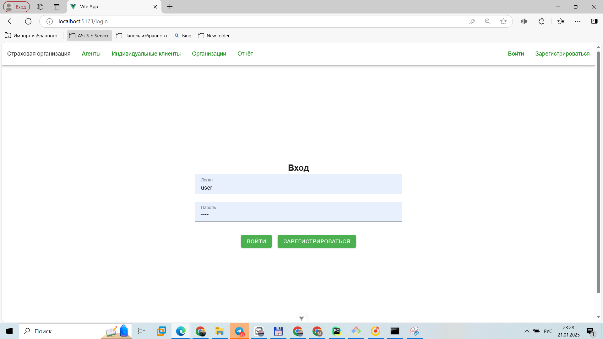

# Лабораторная работа 4. Реализация клиентской части средствами Vue.js.

## Запуск программы
```
python manage.py runserver
```
```
npm run dev
```


## Обзор основных разделов и страниц сайта

#### 1. Страница регистрации


#### 2. Страница авторизации


#### 3. Раздел с информацией об агентах


#### 4. Раздел с информацией об индивидуальных клиентах


#### 5. Раздел с информацией об организациях


#### 6. Раздел с отчетом


## Обзор раздела с агентами и листинг основных моментов
### Основные элементы
#### Cписок всех агентов:


#### Добавление информации об агенте:


#### Просмотр всей информации об агенте:


#### Редактирование информации об агенте:


### Листинг

#### Основная страница со списком всех агентов

##### Листинг вспомогательных компонент

AgentModal.vue

``` vue
<script setup>
import {ref, watch} from "vue";
const props = defineProps({
  modelValue: {
    type: Boolean,
    required: true,
  },
  agentData: {
    type: Object,
    default: () => ({first_name: "", second_name: "", patronymic: "", passport: "", phone_number: ""}),
  },
  mode: {
    type: String,
    default: "add",
  },
});
const emits = defineEmits(["update:modelValue", "submit-agent"]);
const formData = ref({...props.agentData});
watch(
    () => props.agentData,
    (newVal) => {
      formData.value = {...newVal};
    }
);
function closeModal() {
  emits("update:modelValue", false);
}
function handleSubmit() {
  emits("submit-agent", formData.value);
  closeModal();
}
</script>

<template>
  <v-dialog :model-value="modelValue" @update:model-value="closeModal" persistent max-width="500">
    <v-card>
      <v-card-title>{{ mode === "add" ? "Добавить агента" : "Редактировать агента" }}</v-card-title>
      <v-card-text>
        <v-form @submit.prevent="handleSubmit">
          <v-text-field v-model="formData.first_name" label="Имя" required></v-text-field>
          <v-text-field v-model="formData.second_name" label="Фамилия"required></v-text-field>
          <v-text-field v-model="formData.patronymic" label="Отчество" required></v-text-field>
          <v-text-field v-model="formData.passport" label="Номер паспорта" required></v-text-field>
          <v-text-field v-model="formData.phone_number" label="Номер телефона" required></v-text-field>
        </v-form>
      </v-card-text>
      <v-card-actions>
        <v-btn color="red" @click="closeModal">Отмена</v-btn>
        <v-btn color="green" @click="handleSubmit">Сохранить</v-btn>
      </v-card-actions>
    </v-card>
  </v-dialog>
</template>

```

AgentList.vue
``` vue
<script setup>
import {ref} from "vue";
import AgentModal from "@/components/agent/AgentModal.vue";
defineProps({
  agents: {
    type: Array
  }
})
const emits = defineEmits(["delete-agent", "update-agent"]);
const isEditModalVisible = ref(false);
const selectedAgent = ref({});
function handleEdit(agent) {
  selectedAgent.value = {...agent};
  isEditModalVisible.value = true;
}
function handleUpdateAgent(agent) {
  emits("update-agent", agent);
  isEditModalVisible.value = false
}
function deleteAgent(id) {
  emits("delete-agent", id);
}
</script>

<template>
  <div class="agent-list">
    <template v-for="agent in agents" :key="agent.id">
      <v-card class="agent-card" width="600">
        <v-card-title>
          {{ agent.first_name }} {{ agent.second_name }} {{ agent.patronymic }}
        </v-card-title>
        <v-card-subtitle>
          Номер телефона: {{ agent.phone_number }}
        </v-card-subtitle>
        <v-card-actions class="agent-card-actions">
          <v-btn
              size="x-small"
              icon
              :to="`/agents/${agent.id}`"
          >
            <v-icon size="18">mdi-eye</v-icon>
          </v-btn>
          <v-btn
              size="x-small"
              icon
              @click="handleEdit(agent)"
          >
            <v-icon size="18">mdi-pencil</v-icon>
          </v-btn>
          <v-btn
              size="x-small"
              icon
              color="error"
              @click="deleteAgent(agent.id)"
          >
            <v-icon size="18">mdi-delete</v-icon>
          </v-btn>
        </v-card-actions>
      </v-card>
      <div v-if="agents.length === 0">
        Нет данных для отображения.
      </div>
    </template>

    <AgentModal
        v-model="isEditModalVisible"
        :agentData="selectedAgent"
        mode="edit"
        @submit-agent="handleUpdateAgent"
    />
  </div>
</template>

<style scoped>
.mountain-card {
  margin-bottom: 16px;
  position: relative;
  padding-bottom: 50px;
}
.mountain-card-actions {
  position: absolute;
  bottom: 10px;
  right: 10px;
  display: flex;
  gap: 8px;
}
</style>
``` 
##### Листинг основной страницы
AgentList.vue
``` vue
<script setup>
import {ref} from "vue";
import AgentModal from "@/components/agent/AgentModal.vue";
defineProps({
  agents: {
    type: Array
  }
})
const emits = defineEmits(["delete-agent", "update-agent"]);
const isEditModalVisible = ref(false);
const selectedAgent = ref({});
function handleEdit(agent) {
  selectedAgent.value = {...agent};
  isEditModalVisible.value = true;
}
function handleUpdateAgent(agent) {
  emits("update-agent", agent);
  isEditModalVisible.value = false
}
function deleteAgent(id) {
  emits("delete-agent", id);
}
</script>

<template>
  <div class="agent-list">
    <template v-for="agent in agents" :key="agent.id">
      <v-card class="agent-card" width="600">
        <v-card-title>
          {{ agent.first_name }} {{ agent.second_name }} {{ agent.patronymic }}
        </v-card-title>
        <v-card-subtitle>
          Номер телефона: {{ agent.phone_number }}
        </v-card-subtitle>
        <v-card-actions class="agent-card-actions">
          <v-btn
              size="x-small"
              icon
              :to="`/agents/${agent.id}`"
          >
            <v-icon size="18">mdi-eye</v-icon>
          </v-btn>
          <v-btn
              size="x-small"
              icon
              @click="handleEdit(agent)"
          >
            <v-icon size="18">mdi-pencil</v-icon>
          </v-btn>
          <v-btn
              size="x-small"
              icon
              color="error"
              @click="deleteAgent(agent.id)"
          >
            <v-icon size="18">mdi-delete</v-icon>
          </v-btn>
        </v-card-actions>
      </v-card>
      <div v-if="agents.length === 0">
        Нет данных для отображения.
      </div>
    </template>

    <AgentModal
        v-model="isEditModalVisible"
        :agentData="selectedAgent"
        mode="edit"
        @submit-agent="handleUpdateAgent"
    />
  </div>
</template>

<style scoped>
.mountain-card {
  margin-bottom: 16px;
  position: relative;
  padding-bottom: 50px;
}
.mountain-card-actions {
  position: absolute;
  bottom: 10px;
  right: 10px;
  display: flex;
  gap: 8px;
}
</style>
``` 
##### Листинг роутера
``` vue
import {createRouter, createWebHistory} from "vue-router";
import LoginView from "@/views/LoginView.vue";
import RegisterView from "@/views/RegisterView.vue";
import HomeView from "@/views/HomeView.vue";
import AgentView from "@/views/agent/AgentView.vue";
import AgentDetail from "@/views/agent/AgentDetail.vue";
import ClientView from "@/views/client/ClientView.vue";
import ClientDetail from "@/views/client/ClientDetail.vue";
import OrganizationView from "@/views/organization/OrganizationView.vue";
import OrganizationDetail from "@/views/organization/OrganizationDetail.vue";
import ReportView from "@/views/ReportView.vue";
import {tokenStore} from "@/stores/token.js";

const routes = [
    {
        name: 'Login',
        path: '/login',
        component: LoginView
    },
    {
        name: 'Register',
        path: '/register',
        component: RegisterView
    },
    {
          name: 'home',
          path: '/home',
          component: HomeView
    },
    {
          name: 'agents',
          path: '/agents',
          component: AgentView
    },
    {
          name: 'agentDetails',
          path: '/agents/:id',
          component: AgentDetail
    },
    {
          name: 'clients',
          path: '/clients',
          component: ClientView
    },
    {
          name: 'clientDetails',
          path: '/clients/:id',
          component: ClientDetail
    },
    {
          name: 'organization',
          path: '/organizations',
          component: OrganizationView
    },
    {
          name: 'organizationDetails',
          path: '/organizations/:id',
          component: OrganizationDetail
    },
    {
          name: 'report',
          path: '/report',
          component: ReportView
    },
]

const router = createRouter({
    history: createWebHistory(), routes
})

export default router

router.beforeEach((to, from, next) => {
    const token = tokenStore().token;

    if (to.name !== 'Login' && to.name !== 'Register' && !token) {
        next({name: 'Login'});
    } else {
        next();
    }
});
``` 
