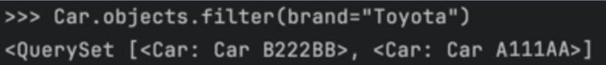
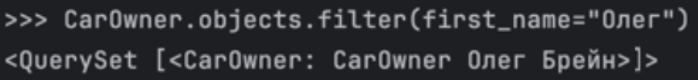
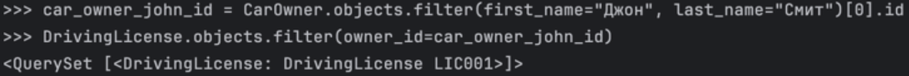
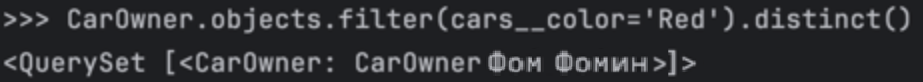
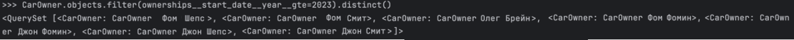
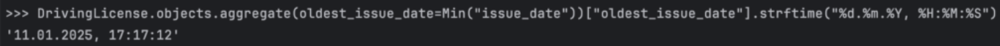
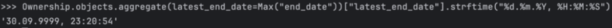
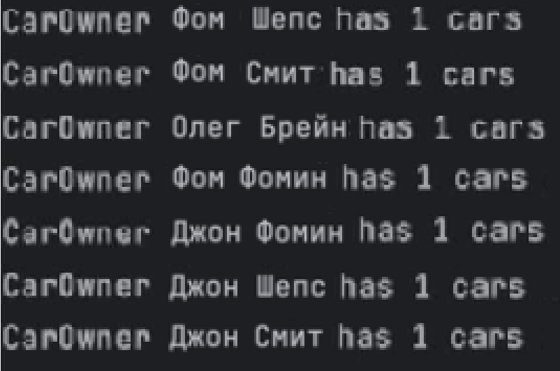
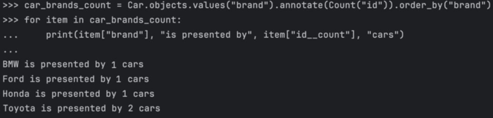
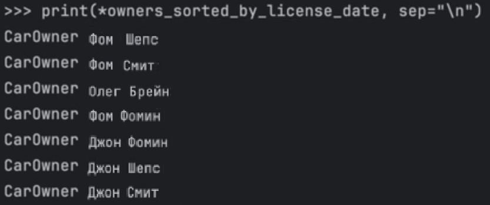

# Практическое задание 3.1. Django Web framework. Запросы и их выполнение.

## Задание 1
#### Условие:
Напишите запрос на создание 6-7 новых автовладельцев и 5-6 автомобилей, каждому автовладельцу назначьте удостоверение и от 1 до 3 автомобилей. Задание можете выполнить либо в интерактивном режиме интерпретатора, либо в отдельном python-файле. Результатом должны стать запросы и отображение созданных объектов.

#### Код (для автовладельцев):
``` 
from project_first_app.models import Car, CarOwner, Ownership, DrivingLicense
from django.utils import timezone

own1 = CarOwner.objects.create(last_name="Шепс", first_name="Фом", birth_date=timezone.now())
own2 = CarOwner.objects.create(last_name="Смит", first_name="Фом", birth_date=timezone.now())
own3 = CarOwner.objects.create(last_name="Брейн", first_name="Олег", birth_date=timezone.now())
own4 = CarOwner.objects.create(last_name="Фомин", first_name="Фом", birth_date=timezone.now())
own5 = CarOwner.objects.create(last_name="Фомин", first_name="Джон", birth_date=timezone.now())
own6 = CarOwner.objects.create(last_name="Шепс", first_name="Джон", birth_date=timezone.now())
own7 = CarOwner.objects.create(last_name="Смит", first_name="Джон", birth_date=timezone.now())
```
#### Код (для автомобилей):
``` 
car1 = Car.objects.create(registration_number="A111AA", brand="Toyota", model="Camry", color="White")
car2 = Car.objects.create(registration_number="B222BB", brand="Toyota", model="Camry", color="Black")
car3 = Car.objects.create(registration_number="C333CC", brand="Honda", model="Civic", color="Blue")
car4 = Car.objects.create(registration_number="D444DD", brand="Ford", model="Focus", color="Red")
car5 = Car.objects.create(registration_number="E555EE", brand="BMW", model="M3", color="Silver")
``` 

#### Код (связь автомобилей и автовладельцев):
``` 
Ownership.objects.create(owner=own1, car=car1, start_date=timezone.now())
Ownership.objects.create(owner=own2, car=car2, start_date=timezone.now())
Ownership.objects.create(owner=own3, car=car3, start_date=timezone.now())
Ownership.objects.create(owner=own4, car=car1, start_date=timezone.now())
Ownership.objects.create(owner=own5, car=car2, start_date=timezone.now())
Ownership.objects.create(owner=own6, car=car3, start_date=timezone.now())
Ownership.objects.create(owner=own7, car=car4, start_date=timezone.now())
``` 

#### Код (для лицензий):
``` 
DrivingLicense.objects.create(owner=owner1, license_number="LIC001", type="A", issue_date=timezone.now())
DrivingLicense.objects.create(owner=owner2, license_number="LIC002", type="A", issue_date=timezone.now())
DrivingLicense.objects.create(owner=owner3, license_number="LIC003", type="A", issue_date=timezone.now())
DrivingLicense.objects.create(owner=owner4, license_number="LIC004", type="A", issue_date=timezone.now())
DrivingLicense.objects.create(owner=owner5, license_number="LIC005", type="A", issue_date=timezone.now())
DrivingLicense.objects.create(owner=owner6, license_number="LIC006", type="A", issue_date=timezone.now())
DrivingLicense.objects.create(owner=owner7, license_number="LIC007", type="A", issue_date=timezone.now())
``` 

## Задание 2
#### Условие:
Где это необходимо, добавьте related_name к полям модели
1. Выведете все машины марки “Toyota” (или любой другой марки, которая у вас есть)
2. Найти всех водителей с именем “Олег” (или любым другим именем на ваше усмотрение)
3. Взяв любого случайного владельца получить его id, и по этому id получить экземпляр удостоверения в виде объекта модели (можно в 2 запроса)
4. Вывести всех владельцев красных машин (или любого другого цвета, который у вас присутствует)
5. Найти всех владельцев, чей год владения машиной начинается с 2010 (или любой другой год, который присутствует у вас в базе)

#### Где это необходимо, добавьте related_name к полям модели
``` 
from django.contrib.auth.models import AbstractUser
from django.db import models


class Car(models.Model):
    registration_number = models.CharField(max_length=15)
    brand = models.CharField(max_length=20)
    model = models.CharField(max_length=20)
    color = models.CharField(max_length=30)

    def __str__(self):
        return f"Car {self.registration_number}"


class CarOwner(models.Model):
    last_name = models.CharField(max_length=30)
    first_name = models.CharField(max_length=30)
    birth_date = models.DateTimeField()
    cars = models.ManyToManyField(
        Car,
        through="Ownership",
        through_fields=("owner", "car"),
        related_name="owners"
    )

    def __str__(self):
        return f"Car {self.first_name} {self.last_name}"


class Ownership(models.Model):
    owner = models.ForeignKey(CarOwner, on_delete=models.CASCADE, related_name="ownerships", null=True)
    car = models.ForeignKey(Car, on_delete=models.CASCADE, related_name="ownerships", null=True)
    start_date = models.DateTimeField()
    end_date = models.DateTimeField(null=True)

    def __str__(self):
        return f"Ownership {self.car} of {self.owner}"


class DrivingLicense(models.Model):
    owner = models.ForeignKey(CarOwner, on_delete=models.CASCADE, related_name="licenses")
    license_number = models.CharField(max_length=10)
    type = models.CharField(max_length=10)
    issue_date = models.DateTimeField()

    def __str__(self):
        return f"DrivingLicense {self.license_number}"


class CustomUser(AbstractUser):
    passport_number = models.CharField(max_length=20)
    home_address = models.CharField(max_length=100)
    nationality = models.CharField(max_length=30)
```

####1. Выведете все машины марки “Toyota”
``` 
Car.objects.filter(brand="Toyota")
``` 


####2. Найти всех водителей с именем “Олег”
``` 
CarOwner.objects.filter(first_name="Олег")
``` 


####3. Взяв любого случайного владельца получить его id, и по этому id получить экземпляр удостоверения в виде объекта модели (можно в 2 запроса)
``` 
car_owner_john_id = CarOwner.objects.filter(first_name="Джон", last_name="Смит")[0].id
DrivingLicense.objects.filter(owner_id=car_owner_john_id)
``` 


####4. Вывести всех владельцев красных машин
``` 
CarOwner.objects.filter(cars__color='Red').distinct()
``` 


####5. Найти всех владельцев, чей год владения машиной начинается с 2022
``` 
CarOwner.objects.filter(ownerships__start_date__year__gte=2023).distinct()
``` 


## Задание 3
#### Условие:
Необходимо реализовать следующие запросы c применением описанных методов:
1. Вывод даты выдачи самого старшего водительского удостоверения
2. Укажите самую позднюю дату владения машиной, имеющую какую-то из существующих моделей в вашей базе
3. Выведите количество машин для каждого водителя
4. Подсчитайте количество машин каждой марки
5. Отсортируйте всех автовладельцев по дате выдачи удостоверения 

####1. Вывод даты выдачи самого старшего водительского удостоверения
``` 
DrivingLicense.objects.aggregate(oldest_issue_date=Min("issue_date"))["oldest_issue_date"].strftime("%d.%m.%Y, %H:%M:%S")
``` 


####2. Укажите самую позднюю дату владения машиной, имеющую какую-то из существующих моделей в вашей базе
``` 
Ownership.objects.aggregate(latest_end_date=Max("end_date"))["latest_end_date"].strftime("%d.%m.%Y, %H:%M:%S")
``` 


####3. Выведите количество машин для каждого водителя
``` 
CarOwner.objects.annotate(num_cars=Count('cars')).values('id', 'num_cars')
``` 


####4. Подсчитайте количество машин каждой марки
``` 
car_brands_count = Car.objects.values("brand").annotate(Count("id")).order_by("brand")
for item in car_brands_count:
    print(item["brand"], "is presented by", item["id__count"], "cars")
``` 


####5. Отсортируйте всех автовладельцев по дате выдачи удостоверения 
``` 
owners_sorted_by_license_date = CarOwner.objects.filter(
    licenses__isnull=False
).annotate(
    earliest_license_date=Min("licenses__issue_date")
).order_by(
    "earliest_license_date"
)
print(*owners_sorted_by_license_date, sep="\n")
``` 

